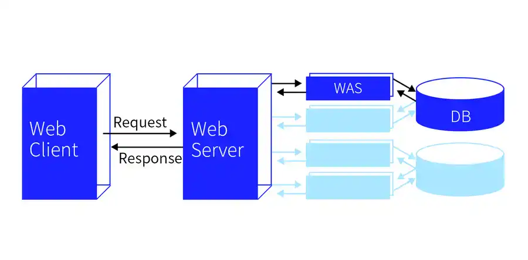

## 웹 동작의 구성 요소와 동작원리

### 웹 
- 기본적으로 클라이언트와 서버와의 상호작용이 이뤄지게 되고 다른 여려 요소들의 요청과 응답으로 데이터를 받아온다.

### 웹 클라이언트 
- 사용자가 웹에 접근하는 프로그램으로 일반적으로 웹 브라우저를 말한다.

### 웹 서버 
- 웹 페이지, 사이트 또는 앱을 저장하는 프로그램. 대표적으로 아파치 웹 서버, GWS 등이 존재한다.

### WAS 
- 서버를 도와주는 역할로 웹 어플리케이션을 수행해주는 미들웨어를 말한다. 대표적으로 아마치 톰캣, 레진 등이 있다.

### DB 
- 데이터의 정보를 저장하는 곳으로 WAS에서 데이터를 요청하면 DB는 이에 맞는 응답을 보낸다.
 

### 구체적인 웹의 동작 원리

- 사용자가 웹 브라우저를 통해 웹 페이지의 URL 주소를 입력하면, HTTP 요청 메시지를 생성함.
- 생성된 요청 메시지는 인터넷을 거쳐 해당 주소의 컴퓨터로 전송됨.
- 도착한 요청 메시지는 HTTP 프로토콜을 사용하여 웹 페이지 URL 정보로 변환됨.
- 웹 서버는 도착한 웹 페이지 URL 정보에 해당하는 데이터를 검색함.
- 검색된 웹 페이지 데이터는 또 다시 HTTP 프로토콜을 사용하여 HTTP 응답 메시지를 생성함.
- 이렇게 생성된 HTTP 응답 메시지는 원래 컴퓨터로 전송됨.
- 도착한 응답 메시지는 HTTP 프로토콜을 사용하여 웹 페이지 데이터로 변환됨.
- 변환된 웹 페이지 데이터는 웹 브라우저에 의해 출력되어 사용자가 볼 수 있게 됨.

## Node.js 요약

### Node.js의 기본 정보

- 자바스크립트 런타임 환경으로, 서버 측에서 자바스크립트를 실행할 수 있는 환경을 제공한다.

### Node.js의 작동(장점)

- 이벤트 루프: Node.js는 이벤트를 대기하고 있다가 이벤트가 발생시 이벤트 핸들러를 호출한다.
- 콜백 함수: Node.js에서 대부분의 함수는 콜백 함수를 사용하여 비동기식으로 실행된다. 이 콜백 함수는 비동기 작업이 완료되면 호출된다.
- 논블로킹 I/O: Node.js는 논블로킹 I/O를 사용하여 요청 작업을 비동기식으로 처리해, CPU 사용률을 최적화할 수 있다.
- 싱글 스레드: 여러 스레드를 사용하는 app과는 달리, 단일 스레드에서 모든 작업을 처리해, 하나의 작업이 오래걸리지 않는 이상 높은 처리량과 성능을 유지할 수 있다.

### Node.js의 단점

- 콜백 함수: 비동기 기반의 처리 방식으로 서버의 로직이 복잡한 경우 callback hell에 빠질 수 있다.
- 싱글 스레드: 하나의 작업이 오래 걸리는 서비스의 경우 성능 저하가 나타날 수 있다.
- 에러 처리: 해당 코드의 수행이 일어났을 때 코드에서 에러가 나는지 알 수 있다. 또한 에러가 날 경우 프로세스 자체가 다운될 수 있다.
- 세션 공유: 세션 공유 시 부가적인 인프라가 필요하다.

### Node.js가 어울리는 서비스
- 간단한 로직
- 대량의 클라이언트가 접속하는 서비스(입출력 많음)
- 빠른 개발 요구
- 빠른 응답시간 요구
- 비동기 방식에 어울리는 서비스 (ex. 스트리밍 서비스, 채팅 서비스)

### Node.js가 어울리지 않는 웹서비스
- 단일 작업이 오래 걸리는 서비스
- 로직 복잡도가 높은 경우

## Git hub 요약 

### git이란?
- git은 버전관리 소프트웨어로 프로젝트 진행시 작업한 코드를 기록하고 보관할수 있다 떄문에 프로젝트 진행시 버그가 있거나 실수로 코드를 잘못올린 경우 이전 버전으로 돌아가 편리하게 코드를 작성할수 있다.

### git init
- 작업할 폴더를 git이 감시할수 있게 하는 명령어이다. git init명령어 실행시 해당 폴더에서 작성한 코드나 파일을 git명령어로 관리할수 있다.

### git add & git commit
- git은 작성한 코드의 수정사항 추가 사항을 각각 기록할수 있는데 이기록을 알려주기 위해 git add, commit 명령어를 사용한다. 이떄 코드나 파일은 staging area, repository라고 부르는 두가지 공간에 나눠서 저장되는데, stage area에 기록할만한 코드나 파일을 git add로 저장하고, git commit명령어로 repository에 저장한다. 

### git diff
- git diff명령어는, commit전에, 이전 commit과 현재 작성한 코드들이 어떤 차이점이 있는지 보여준다.

### git branch
- 프로젝트를 진행하다가 새로운 기능을 만들고 싶을때가 있다. 이떄 git branch를 사용하면, 분기가 생겨 원래 프로젝트에 지장을 주지 않고 기능을 추가해보거나 수정해보는 코드를 작성할수 있게된다.

- git branch {branch name} 명령어로 branch를 만들고 
- git switch {branch name} 으로 해당 branch로 전환하여 작업할수 있다.

### git merge
- 생성한 branch에서의 작업에 오류가 없고 완료되었다면 git merge 명령어로  해당 branch를 본 프로젝트에 합쳐 추가되거나 수정된 내용을 반영할수 있다.

### 원격 repository
-지금까지 배운 내용은 로컬 레포지토리에서만 버전관리를 하는 과정이었다. 하지만 로컬 PC는 개인이 쓰기 떄문에 협업에는 적절하지 않다. 따라서 원격 레포지토리에서 add,commit하는 과정이 필요하고 이를 통해 여러사람이 같은 레포지토리를 편리하게 공유할수 있다.

### git push
- git push는 로컬에서 한 작업을 원격 레포지토리에 적용하거나 업로드하는 역할을 한다

### git pull
- 로컬 저장소에서 작업을 하다보면 main과 다른 파일을 저장하게 되는 경우가 있다
- 이때 git pull명령어를 통해 현재 remote repository의 상태를 local로 불러올수 있다.

## 다양한 merge 방식

### 3-way merge 
- 브랜치에 각각 신규 commit이 있는 경우 merge 명령을 내리면 두 브랜치의 코드를 합쳐서 새로운 commit을 자동으로 생성해주는데 이를 3-way merge라고 한다. 일반적인 merge의 동작이다.

### fast-forward merge
- 새로운 브랜치에만 commit 이 있고 기준이 되는 브랜치에는 신규 commit 이 없는 경우 합칠게 없어서 신규branch 를 main branch로 지정하는것

### squash and merge
- main 브랜치 git log 출력시 3-way merge된 브랜치들의 commit 내역도 다 같이 출력되어 지저분해지는 경우가 있는데 이때 squash and merge 하면 main 브랜치에 붙여주어 깔끔하게 log를 관리할수 있다.

## 전체 웹 서비스 런칭 과정

1. 기획 단계: 웹 서비스를 기획하는 단계로, 아이디어 도출, 시장 조사, 경쟁사 분석 등이 포함됨.
    - 아이디어의 구체화 필요
    - 비즈니스 모델 수립

2. 디자인 단계: 웹 서비스 디자인을 구상하고 디자인을 작성하는 단계
    - UX/UI 고려 필요
    - 디자인 가이드 검토

3. 프론트엔드 개발 단계: 디자인을 기반으로 UI/UX를 개발하는 단계
    - 개발을 위한 기술과 툴 결정
    - UI/UX 개발

4. 백엔드 개발 단계: 데이터 저장 및 처리, 보안, API 및 서버 아키텍처 설계 등을 수행하는 단계
    
    - 서버 아키텍처 설계: 백엔드 개발자는 서버 아키텍처를 설계해야 합니다. 이 단계에서는 서버 구성 요소, 데이터베이스, 캐시 등의 요소를 결정하고 서버가 수행해야 할 작업을 식별합니다.

    - 데이터베이스 설계: 백엔드 개발자는 데이터베이스 설계도 작성해야 합니다. 데이터베이스 설계에서는 데이터 구조, 필드, 인덱스, 키 등의 세부 정보가 포함됩니다.

    - API 설계: 백엔드 개발자는 API(Application Programming Interface)를 설계합니다. API 설계에서는 요청과 응답의 형식, URL 엔드포인트, 매개변수, 반환 값 등이 정의됩니다.

    - 서버 코딩: 백엔드 개발자는 서버 코드를 작성해야 합니다. 이 단계에서는 서버 아키텍처 설계 및 API 설계를 기반으로 서버 코드를 작성합니다.

    - 데이터베이스 코딩: 백엔드 개발자는 데이터베이스 코딩을 수행합니다. 이 단계에서는 데이터베이스 설계를 기반으로 데이터베이스 스키마를 작성하고, 쿼리와 저장 프로시저 등의 데이터베이스 코드를 작성합니다.

    - API 구현: 백엔드 개발자는 API를 구현합니다. 이 단계에서는 API 설계를 기반으로 API 코드를 작성합니다.

    - 보안 구현: 백엔드 개발자는 보안 구현을 수행합니다. 이 단계에서는 SSL 인증서, 인증 및 권한 부여, 암호화 등의 보안 요소를 구현합니다.

    - 서버 성능 최적화: 백엔드 개발자는 서버 성능을 최적화합니다. 이 단계에서는 서버 부하 테스트, 캐싱, 압축, 최적화된 데이터베이스 인덱싱 등의 요소를 사용하여 서버 성능을 향상시킵니다.

5. QA 및 테스트 단계: 개발한 웹 서비스에 대한 테스트를 수행하는 단계
    - 브라우저,모바일등 다양한 환경에서의 호환성 테스트
    - 성능 최적화

6. 배포 단계: 개발된 웹 서비스를 서버에 배포하는 단계입니다.
    - 서버 구성, 빌드 및 배포 스크립트를 작성

        - 서버 배포: 백엔드 개발자는 서버를 배포합니다. 이 단계에서는 서버 구성, 빌드 및 배포 스크립트를 작성하고, 서버를 호스팅할 클라우드 서비스나 독립적인 서버에 서버를 배포합니다.

    - 서버를 호스팅할 클라우드 서비스나 독립적인 서버에 서버를 배포

7. 운영 단계: 배포된 웹 서비스를 운영하는 단계
    - 서버 모니터링, 유지보수 등을 수행

    - 서버 유지보수: 백엔드 개발자는 서버 유지보수를 수행합니다. 이 단계에서는 서버에 대한 문제를 해결하고, 보안 패치를 적용하며, 서버 업데이트 및 업그레이드를 수행합니다. 또한, 서버 성능 모니터링을 수행하고, 서버 로그를 검토하여 이상 징후를 식별하고 해결합니다.

    - 서버 업데이트 및 패치적용